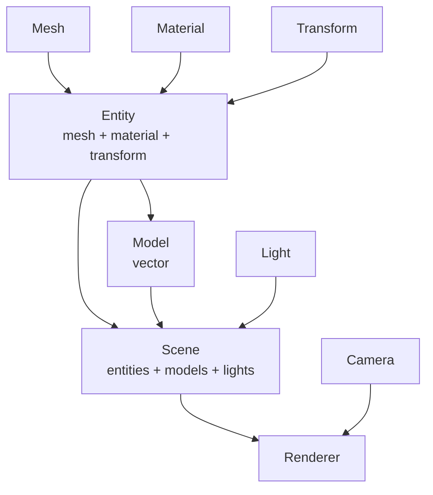
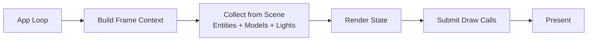

# GLRenderer

- Build it by MSVC with C++20.
- Refer to LearOpenGL, Godot, EnTT and So on.

# NameFormat

- file name(xxXxx)
- class name(XxXxx)
- class member var name(mXxx)
- struct name(XxXxx)
- struct member var name(--xxXxx--)
- all funcs name(XxXxx)
- temporary var or func var(xxXxx)
- cpu to gpu data var name keep same

# Architecture Design

> Disclaimer: 小孩子👶不懂事做着玩的😋.

## Core Features

- ✅ `Window`
  - GLFW window wrapper
  - Input event handling
- ✅ `Camera`
  - Roaming camera with mouse/keyboard
  - Perspective projection & orthographic projection
- ✅ `Mesh`
  - Holds geometry data and GPU resources (VAO/VBO/EBO)
  - Primitive factory functions can generate cube/sphere/plane for testing
- ✅ `Transform`
  - Holds position, rotation, scale(only for itself)
- ✅ `Material`
  - Manages shader/texture/uniform concepts
- ✅ `Light`
  - Directional Light
  - Point Light
  - Spot Light
- ✅ `Entity`
  - A renderable unit: binds `Mesh + Material + Transform`
  - one parent(index), multiple children
- ✅ `Model`
  - Holds a container of `Entity`
- ✅ `Scene`
  - Holds `Entity` list, `Model` list, `Light` list
  - Maintain parent-child relationship and logic
- ✅ `Renderer`
  - Stateless service entry
  - Renderer Pass & Renderer Graph Architecture
  - Interface: `Render(const Scene&, const Camera&)`
- ✅ `Assimp Model Loader`
- ✅ `Shadow Mapping`
- ⬜ `PBR + IBL`
- ✅ `Post Process`
- ⬜ `IMGUI Editor`

## Module Graph

## Per-frame Render Flow

