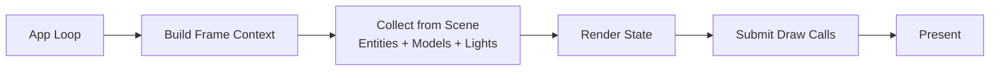

# GLRenderer

- Refer to LearnOpenGL
- Build it by MSVC

# NameFormat

- file name(xxXxx)
- class name(XxXxx)
- class member var name(mXxx)
- struct name(XxXxx)
- struct member var name(--xxXxx--)
- all funcs name(XxXxx)
- temporary var or func var(xxXxx)

# Implemented

    GLFW Window
    Roaming Camera
    Shader
    Texture
    Mesh

# Todo

    Lights
    Shadow Mapping
    Disney PBR
    IBL
    Transform
    Post Process
    Deferred Rendering Pipeline
    IMGUI Editor
    Assimp Model Loader

# Architecture Design
> Disclaimer: Children don't understand things and just play around.(免责声明: 小孩子不懂事做着玩的😋)
> Goal: clear and practical renderer architecture for portfolio project.  
> Scope now: concept-first, lightweight implementation.

## Core Features

- ✅ `Mesh`
  - Holds geometry data and GPU resources (VAO/VBO/EBO)
  - Primitive factory functions can generate cube/sphere/plane for testing
- ⬜ `Material`
  - Manages shader/texture/uniform concepts
- ⬜ `Light`
  - Directional Light
  - Point Light
  - Spot Light
- ⬜ `Entity`
  - A renderable unit: binds `Mesh + Material`
- ⬜ `Model`
  - Holds a container of `Entity`
- ⬜ `Scene`
  - Holds `Entity` list, `Model` list, `Light` list
- ⬜ `Renderer`
  - Stateless service entry
  - Interface: `Render(const Scene&, const Camera&)`

## Module Graph

```mermaid
graph TD
    Mesh[Mesh]
    Material[Material (base)]
    Entity[Entity<br/>mesh + material]
    Model[Model<br/>vector<Entity>]
    Light[Light (base)]
    Scene[Scene<br/>entities + models + lights]
    Camera[Camera]
    Renderer[Renderer]

    Mesh --> Entity
    Material --> Entity
    Entity --> Model
    Entity --> Scene
    Model --> Scene
    Light --> Scene
    Scene --> Renderer
    Camera --> Renderer
```

## Per-frame Render Flow (Concept)



## Runtime Data Flow (Current Stage)

1. Create primitives (`Mesh`) for quick testing
2. Create `Entity(mesh, material)`
3. Optional: group entities into `Model`
4. Add `Entity/Model/Light` into `Scene`
5. Call `Renderer::Render(scene, camera)`

## Reserved Extension Points (placeholders)

- `RenderState` system (pipeline state grouping/sorting)
- `AssetManager` (resource cache & deduplication)
- `Transform` (deferred to later stage)
- Advanced materials/lights/shadows/post-process